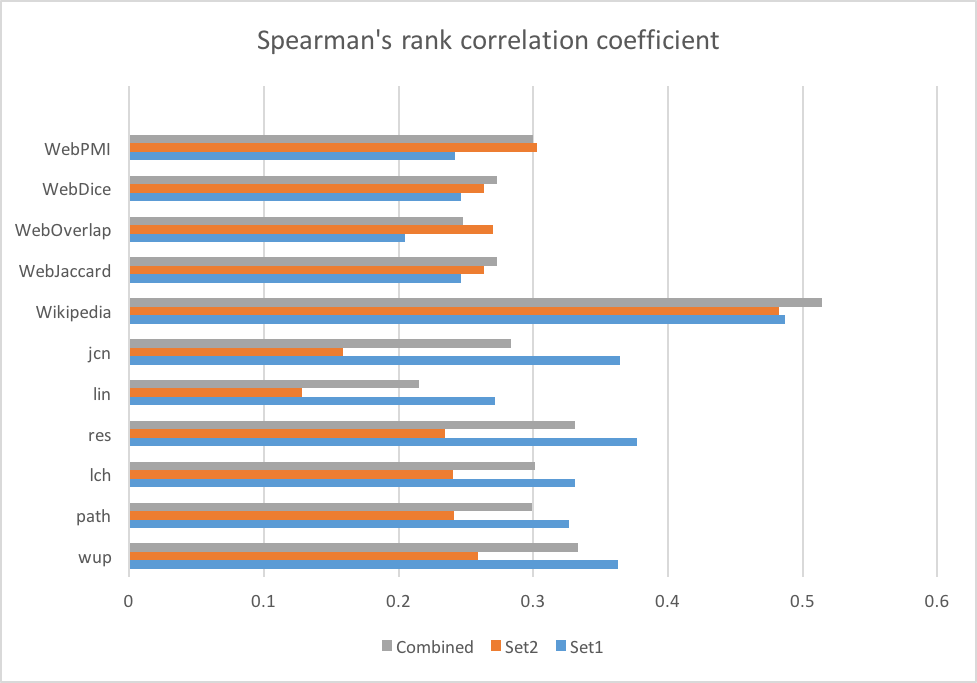

# WordSimilarity Report
## 背景介绍
词汇相似度计算

基于WordSimilarity-353进行实验和分析

## 工具和数据集
实验数据：

* WordSimilarity-353

环境：

* Python 2.7
* 通过Socks代理访问google.com

工具：

* nltk (wordnet)
* gensim (word2vec)
* scipy (spearman's)

训练数据：

* word2vec Text8 (Wikipedia)

评价方法：

* Spearman's rank correlation coefficient

## 算法
WordSimilarity中实现了11种词汇相似度计算算法，分别为：

* 基于WordNet的方法（包括路径、互信息）
 - wup
 - path
 - lch
 - res
 - lin
 - jcn
* 基于语料统计（Wikipedia）的方法
 - word2vec (text8)
* 基于检索页面数量的方法
 - WebJaccard
 - WebOverlap
 - WebDice
 - WebPMI

## 实验结果
|Type|Method|Set1|Set2|Combined|
|----|------|----|----|--------|
|WordNet|wup|0.36255846229870486|0.25905569671745343|0.33332379890701924|
|WordNet|path|0.32677907139026102|0.24155412145614147|0.29944020894638224|
|WordNet|lch|0.33072459752482536|0.24065135868690002|0.30119153189226205|
|WordNet|res|0.37671422400160803|0.23423931416958305|0.33087501022995874|
|WordNet|lin|0.27170388046808192|0.12852355622785497|0.21498948179442201|
|WordNet|jcn|0.36455532933566515|0.15868977496793157|0.28335379720739173|
|Word2Vec|Wikipedia|0.48656240830368941|0.48263037755410648|0.51401301053230553|
|PageCount|WebJaccard|0.2465068743437667|0.26380255314838158|0.27317170694495496|
|PageCount|WebOverlap|0.20499317238316905|0.26977554023791178|0.2481105718669597|
|PageCount|WebDice|0.2465068743437667|0.26380255314838158|0.27317170694495496|
|PageCount|WebPMI|0.24207669077967967|0.30282391799442809|0.29971820605501664|

## 实验结果分析
1. 利用Wikipedia语料的方法明显好于基于WordNet和PageCount的方法。其原因在于WordNet的信息量比较有限，一些词语（如CD等）没有被收录到语义词典中，而且收录的词语不同词性之间也无法计算语义相似度。PageCount的则只考虑了页面搜索数量，因此相关系数也较低。

2. 从总体来看，基于WordNet的方法略好于PageCount方法，因为PageCount方法没有考虑到词语之间的词汇层级关系和语义关系。但是这些特征并不显著影响结果，而且影响程度在不同的数据集上有显著差异。因此可以看到，在Set1上基于WordNet的方法好于PageCount方法，在Set2上则相反。

3. 在实验中Wikipedia语料仍然有限(text8大小约为100MB)，因此如果使用更多语料，可能会获得更好的结果。

